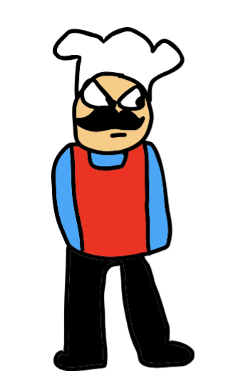

<html>
  <head>
    <title>Fringadungaloo</title>
    
  </head>

  <body><h1>Hello! Welcome to the official FRINGADUNGALOO Website!</h1></body>
  

<body><h2>This will answer all your questions about the books which have been completed.</h2></body>
<body><b>"How many books are in the series?"</b></body>
 
<body><b>9 books including: BARNACLES, SUBCHRONICLE, BANIVERSE, STRANDED, OMLIVERSE, BARNACLIZATION, REVELETTE, Mega Mashup and Concepts</b></body>
 
<body><b>"What is the longest and shortest book in the series?"</b></body>
 
<body><b>The shortest book in the series is STRANDED.</b></body>
 
<body><b>uuhhhh..... i have no more questions to give you so uhhh idk come back tomorrow or something</b></body>
 
<body><h1>FACTS</h1></body>
 <body><b>Omallete man is based off of HorrorSkunx's Omelette man.</b></body>
<marquee bgcolor = yellow><h1>UNDER CONSTRUCTION PLS COME BACK TOMORROW</h1></marquee>
</html>
